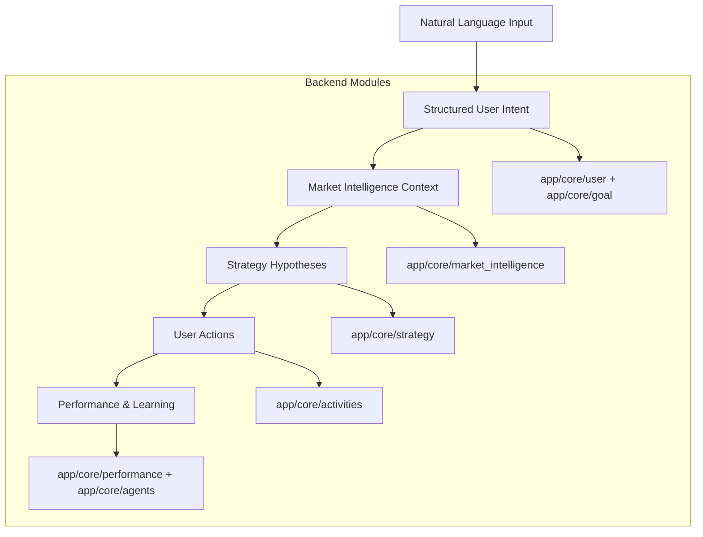

# AAQ Data Transformation Template

This document finalizes the end-to-end data transformation flow for AAQ. It maps directly to the backend modules and is structured for implementation.

## Flowchart

## Stage 1: Natural Language -> Structured User Intent

**Input**
- Free-text user input (chat, onboarding form, voice transcription)

**Transformation logic**
- LLM-based semantic extraction (intent, risk, horizon, constraints)

**Output (Pydantic)**
- `UserData`
- `Goal`

**Persistence**
- Postgres (stable profile + goals)

**Consumes next**
- Market intelligence, strategy generation

**Backend modules**
- `app/core/user`
- `app/core/goal`

---

## Stage 2: User + Goal -> Market Intelligence Context

**Input**
- `UserData`
- `Goal`
- External data feeds (prices, macro, news)

**Transformation logic**
- Filter and score signals by user profile (region, asset class, risk, horizon)

**Output (Pydantic)**
- `MarketSnapshot`
- `MarketSignal`

**Persistence**
- Postgres (time-series / append-only)

**Consumes next**
- Strategy generation, dashboard summaries

**Backend modules**
- `app/core/market_intelligence`

---

## Stage 3: Market Context -> Strategy Hypotheses

**Input**
- `UserData`
- `Goal`
- `MarketIntelligence`

**Transformation logic**
- Hypothesis generation with explainability + backtest requirement

**Output (Pydantic)**
- `Strategy`
- `BacktestResult`

**Persistence**
- Postgres (versioned strategies)

**Consumes next**
- User decision interface, performance tracking, agent evaluation

**Backend modules**
- `app/core/strategy`

---

## Stage 4: Strategy -> User Actions (Execution & Tracking)

**Input**
- Strategy recommendation
- User decision (accept/modify/reject)

**Transformation logic**
- Human-in-the-loop checkpoint and execution trace

**Output (Pydantic)**
- `Decision`
- `ExecutionTrace`

**Persistence**
- Postgres (event-style records)

**Consumes next**
- Performance evaluation, audit, learning signals

**Backend modules**
- `app/core/activities`

---

## Stage 5: Outcomes -> Performance & Learning

**Input**
- Execution data
- Market outcomes
- User feedback

**Transformation logic**
- Multi-objective scoring (alpha, drawdown, trust, acceptance rate)

**Output (Pydantic)**
- `PortfolioPerformance`
- `LearningMetrics`

**Persistence**
- Aggregated metrics + raw event history in Postgres

**Consumes next**
- Strategy ranking, policy updates, future recommendations

**Backend modules**
- `app/core/performance`
- `app/core/agents`

---

## End-to-End Summary Table

| Stage | Input | Transformation | Output |
| --- | --- | --- | --- |
| 1 | Natural language | Intent extraction | `UserData`, `Goal` |
| 2 | User + Goal | Context filtering | `MarketSnapshot`, `MarketSignal` |
| 3 | Market context | Hypothesis generation | `Strategy`, `BacktestResult` |
| 4 | Strategy | Human decision capture | `Decision`, `ExecutionTrace` |
| 5 | Outcomes | Evaluation & learning | `PortfolioPerformance`, `LearningMetrics` |

---

## Implementation Notes

- Keep each stage isolated to a single core module; pass typed Pydantic models between stages.
- Store raw inputs alongside derived outputs to enable audits and replays.
- Ensure each stage exposes a service boundary (e.g., `service.py`) even if logic is initially simple.
